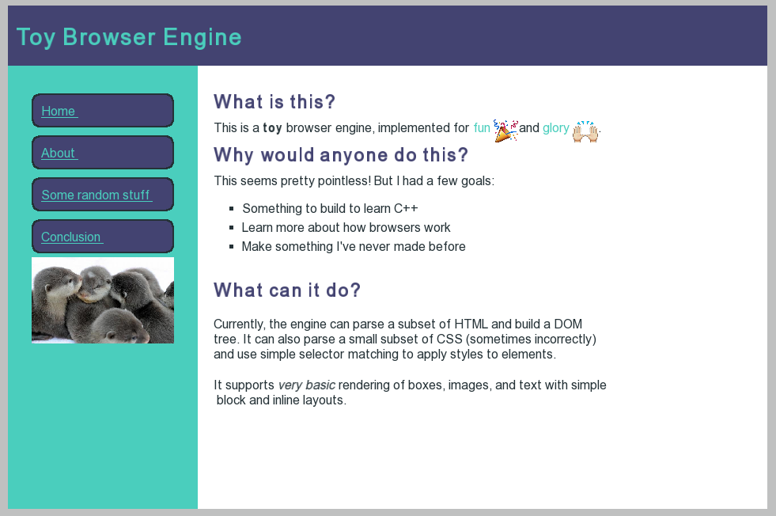

# Toy browser engine in C++

This is a toy (very limited functionality) browser engine, implemented for
fun as an exercise to learn C++. It was inspired by ad modeled after Matt Brubeck's
[toy implementation in Rust](https://github.com/mbrubeck/robinson).

Given [some html](examples/demo.html) and [simple css](examples/demo.css),
the engine can render a page.

As rendered in Chrome


As rendered in toy engine


The browser engine consists of parsers (for parsing HTML into a DOM tree,
and CSS into a set of style rules), selector logic for matching styles
with DOM nodes, and layout and rendering logic for determining how to
paint the screen. We use SFML, so the low-level painting primitives are
shapes (rectangles) and individual words of text.


## Status

#### Currently implemented:

- Parse a small subset of HTML and build a DOM tree.
- Parse a very small subset of CSS.
- Simple (non-nested) selector matching to apply styles to elements (with basic cascading).
- Basic block and inline layouts.
- Basic rendering of boxes, images, and text

#### TODO:
- Load resources from network.
- Parse inline styles and \<style\> tags
- Parse a more extended set of HTML tags:
  - tables
  - ```<br>``` line breaks
  - buttons
  - input elements/forms
- Parse a more extended set of CSS properties
  - `text-align`
  - flex-box
  - opacity for colors
  - `position: absolute`, etc
  - percent-based widths and heights
  - shorthands (for margins, padding, etc.)
  - `background-image`
- Handle nested CSS selectors

## Setup

The project uses the [bazel](https://bazel.build/) build system.

#### Dependencies
- [SFML](https://www.sfml-dev.org/) for painting boxes, images, and text
- [Abseil](https://abseil.io/) for various string operations, etc.
- [Gflags](https://github.com/gflags/gflags)

Code is formatted using clang-format in the google style. To format, run:
clang-format style=file -i src/*.cc src/*.h src/render/* src/parse/*

#### Instructions

1. Install bazel and SFML (e.g. with [Homebrew](https://brew.sh/)).
Update the `new_local_repository` in the bazel WORKSPACE file to point to
wherever SFML is installed.

2. Build from the root directory with ```bazel build //src:browser```

3. Run the binary ```bazel-bin/src/browser```
